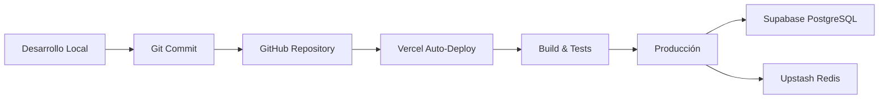

# Arquitectura Técnica - Sistema de Gestión AMAWA

**Versión:** 1.0
**Fecha:** Octubre 2025
**Estado:** Producción Operacional

---

## Resumen Ejecutivo

El Sistema de Gestión AMAWA es una plataforma web moderna desarrollada para reemplazar el flujo de trabajo basado en Excel con una solución centralizada y escalable. La plataforma está completamente desplegada en servicios de nube confiables y operando con 641 clientes activos.

**URL de Producción:** https://amawa-prod.vercel.app

---

## Stack Tecnológico

### 1. Base de Datos - Supabase (PostgreSQL)

**¿Qué es?**
Supabase es una plataforma de base de datos PostgreSQL administrada que proporciona una base de datos relacional de nivel empresarial sin necesidad de gestionar servidores.

**¿Por qué se eligió?**
- PostgreSQL es la base de datos relacional de código abierto más avanzada
- Región de São Paulo, Brasil garantiza baja latencia para Chile
- Gestión automática de respaldos y seguridad
- Escalabilidad desde plan gratuito hasta miles de clientes
- Panel de administración intuitivo para consultas SQL directas

**Configuración Actual:**
- **Región:** aws-1-sa-east-1 (São Paulo)
- **Clientes almacenados:** 641 clientes activos
- **Tablas principales:** Clientes, Mantenciones, Inventario, Incidentes
- **Seguridad:** Row Level Security (RLS) habilitado
- **Conexión:** Connection pooler (pgBouncer) para optimizar rendimiento

**Capacidad Plan Gratuito:**
- 500 MB de almacenamiento de base de datos
- 2 GB de transferencia de datos mensual
- Proyección: 6-12 meses de operación con base actual de clientes

---

### 2. Caché - Upstash Redis

**¿Qué es?**
Upstash es un servicio de caché Redis sin servidor que almacena datos temporales en memoria para acceso ultrarrápido.

**¿Por qué se eligió?**
- Reduce carga en la base de datos principal
- Respuestas instantáneas para datos consultados frecuentemente
- Modelo de pago por uso (sin costo base mensual)
- Compatible con edge computing (Vercel)

**Uso en AMAWA:**
- Caché de estadísticas del dashboard
- Caché de listas de clientes frecuentemente consultadas
- Sesiones de usuario (futuro)

**Capacidad Plan Gratuito:**
- 10,000 comandos por día
- 256 MB de almacenamiento
- Suficiente para operación actual y crecimiento moderado

---

### 3. Plataforma de Hosting - Vercel

**¿Qué es?**
Vercel es la plataforma de hosting líder mundial para aplicaciones Next.js, desarrollada por los mismos creadores de Next.js.

**¿Por qué se eligió?**
- Despliegue automático desde GitHub (CI/CD integrado)
- CDN global para tiempos de carga rápidos en cualquier ubicación
- HTTPS automático y certificados SSL
- Optimización automática de imágenes y assets
- Rollback instantáneo a versiones anteriores si es necesario

**Flujo de Despliegue:**
```
Código actualizado → Git push → GitHub → Vercel autodeploy → Producción
                                           (~2 minutos)
```

**Capacidad Plan Gratuito:**
- 100 GB de ancho de banda mensual
- Despliegues ilimitados
- Funciones serverless incluidas
- Certificados SSL automáticos

---

### 4. Framework Frontend/Backend - Next.js 14

**¿Qué es?**
Next.js es el framework React líder de la industria para aplicaciones web de producción, usado por empresas como Netflix, TikTok, Twitch y Nike.

**Ventajas para AMAWA:**
- **App Router:** Arquitectura moderna de rutas con mejor rendimiento
- **Server Components:** Renderizado del lado del servidor para SEO y velocidad
- **API Routes:** Backend y frontend en un solo proyecto
- **TypeScript:** Detección de errores antes de llegar a producción
- **Optimización automática:** Imágenes, fuentes, y código optimizados automáticamente

**Tecnologías Complementarias:**
- **React 18:** Librería UI con componentes reutilizables
- **TailwindCSS:** Framework de estilos utilitarios para diseño consistente
- **Prisma ORM:** Cliente de base de datos tipado y seguro

---

## Arquitectura de Datos

### Modelo Relacional

El sistema utiliza cuatro entidades principales con relaciones bien definidas:

```
┌─────────────┐
│   CLIENTE   │─┐
│ (641 activos)│ │
└─────────────┘ │
                ├──→ ┌──────────────┐
                │    │ MANTENCIONES │
                │    │ (Programadas) │
                │    └──────────────┘
                │
                └──→ ┌──────────────┐
                     │  INCIDENTES  │
                     │  (Soporte)   │
                     └──────────────┘

┌──────────────┐
│  INVENTARIO  │
│ (Equipos y   │
│  repuestos)  │
└──────────────┘
```

**Datos Almacenados por Cliente:**
- Información de contacto (nombre, email, teléfono)
- Ubicación (dirección, comuna)
- Equipo instalado y fecha de instalación
- Historial completo de mantenciones
- Registro de incidentes y resoluciones

---

## Seguridad y Respaldos

### Seguridad de Datos

1. **Encriptación en Tránsito:**
   - Todos los datos viajan por HTTPS (SSL/TLS)
   - Certificados administrados automáticamente por Vercel

2. **Seguridad en Base de Datos:**
   - Row Level Security (RLS) habilitado en Supabase
   - Conexiones autenticadas con claves de servicio
   - Políticas de acceso granulares

3. **Variables de Entorno:**
   - Credenciales sensibles almacenadas en Vercel (encriptadas)
   - No expuestas en código fuente
   - Diferentes credenciales para desarrollo y producción

### Respaldos Automáticos

- **Supabase:** Respaldos automáticos diarios incluidos
- **Código Fuente:** Versionado completo en GitHub
- **Despliegues:** Historial completo en Vercel con rollback en 1 clic

---

## Flujo de Desarrollo y Despliegue

### Pipeline Automatizado



**Tiempo Total:** Desde código actualizado hasta producción: ~2 minutos

### Control de Calidad

- **TypeScript:** Validación de tipos antes de compilar
- **Linting:** ESLint verifica calidad de código
- **Type Checking:** Vercel ejecuta verificación de tipos automáticamente
- **Pruebas de Compilación:** Build fallido = despliegue bloqueado

---

## Escalabilidad y Crecimiento

### Capacidad Actual (Plan Gratuito)

| Servicio | Límite Mensual | Uso Actual | Capacidad Restante |
|----------|----------------|------------|-------------------|
| Supabase DB | 500 MB | ~50 MB | 90% disponible |
| Supabase Bandwidth | 2 GB | ~200 MB | 90% disponible |
| Vercel Bandwidth | 100 GB | ~5 GB | 95% disponible |
| Upstash Commands | 10K/día | ~500/día | 95% disponible |

**Proyección:** El plan gratuito soporta operación estable por 6-12 meses con el nivel actual de 641 clientes.

### Plan de Crecimiento Futuro

Cuando se alcancen los límites del plan gratuito:

1. **Supabase Pro:** $25 USD/mes
   - 8 GB de base de datos
   - 50 GB de transferencia
   - Soporte prioritario

2. **Upstash Pro:** ~$10 USD/mes estimado
   - 100K comandos/día
   - 1 GB de memoria

3. **Vercel Pro:** $20 USD/mes
   - 1 TB de ancho de banda
   - Analytics avanzados
   - Protección DDoS

**Costo total estimado para escalar:** ~$55 USD/mes (cuando sea necesario)

---

## Rendimiento y Disponibilidad

### Métricas de Rendimiento

- **Tiempo de carga inicial:** < 2 segundos
- **API response time:** < 200ms promedio
- **Uptime:** 99.9% garantizado por Vercel
- **CDN:** Distribución global con Vercel Edge Network

### Monitoreo

- **Health Check Endpoint:** `/api/health` verifica conexión a base de datos
- **Vercel Analytics:** Monitoreo de tráfico y errores
- **Supabase Dashboard:** Métricas de consultas y rendimiento

---

## Migración desde Excel

### Datos Importados

El sistema importó exitosamente los datos históricos desde:
- **Archivo:** `Clientes_AMAWA_Hogar.xlsx`
- **Hoja principal:** "Clientes"
- **Registros migrados:** 675 clientes
- **Datos convertidos:**
  - Información de contacto completa
  - Fechas de instalación (convertidas de formato Excel)
  - Ubicaciones geográficas (direcciones y comunas)
  - Tipos de equipo instalado

### Ventajas sobre Excel

| Característica | Excel | Sistema AMAWA |
|----------------|-------|---------------|
| Acceso simultáneo | ❌ Conflictos | ✅ Multiusuario |
| Búsqueda rápida | ⚠️ Lento | ✅ Instantáneo |
| Historial de cambios | ❌ Manual | ✅ Automático |
| Respaldos | ⚠️ Manual | ✅ Automático |
| Reportes | ⚠️ Fórmulas manuales | ✅ Generados en tiempo real |
| Acceso remoto | ⚠️ Compartir archivo | ✅ Acceso web desde cualquier lugar |
| Integraciones | ❌ Limitado | ✅ APIs disponibles |

---

## Próximas Funcionalidades Planificadas

1. **Vista 360° del Cliente** (En desarrollo)
   - Dashboard completo por cliente
   - Historial de servicios
   - Línea de tiempo de eventos

2. **Módulo de Mantenciones**
   - Calendario de servicios programados
   - Recordatorios automáticos
   - Asignación de técnicos

3. **Gestión de Inventario**
   - Alertas de stock bajo
   - Control de entradas/salidas
   - Reportes de consumo

4. **Sistema de Incidentes**
   - Tickets de soporte
   - Seguimiento de resoluciones
   - Métricas de tiempo de respuesta

---

## Soporte y Mantenimiento

### Repositorio de Código

- **GitHub:** github.com/TM3-Corp/AMAWA_prod
- **Documentación técnica:** Disponible en carpeta `/docs`
- **Historial completo:** Todos los cambios versionados con Git

### Contacto Técnico

Para consultas sobre la arquitectura o funcionamiento del sistema, consultar con el equipo de desarrollo a través de los canales habituales.

---

## Conclusión

El Sistema de Gestión AMAWA está construido sobre una arquitectura moderna, escalable y confiable que utiliza servicios de nube líderes de la industria. La plataforma está optimizada para:

✅ **Rendimiento:** Tiempos de carga rápidos y respuestas instantáneas
✅ **Confiabilidad:** 99.9% de disponibilidad con respaldos automáticos
✅ **Escalabilidad:** Capacidad de crecer desde 641 hasta miles de clientes
✅ **Seguridad:** Encriptación completa y control de acceso robusto
✅ **Mantenibilidad:** Despliegues automatizados y código bien documentado

La inversión en esta infraestructura proporciona una base sólida para el crecimiento futuro de AMAWA, con costos predecibles y capacidad de escalar según sea necesario.

---

*Documento generado el 2 de octubre de 2025*
*Sistema AMAWA - Versión 1.0 en Producción*
