# AMAWA Development Workflow

## Complete Development & Deployment Pipeline


---

## Detailed Workflow Steps

### 1️⃣ Local Development with Claude Code

```mermaid
sequenceDiagram
    actor Dev as 👨‍💻 Developer
    participant CC as 🤖 Claude Code
    participant Files as 📝 Code Files
    participant Server as ⚙️ Dev Server
    participant Browser as 🌐 Browser

    Dev->>CC: Request: "Build 360° Client View"
    CC->>Files: Generate components
    CC->>Files: Create API routes
    CC->>Files: Write tests
    CC->>Dev: Code ready for review

    Dev->>Server: npm run dev
    Server-->>Browser: http://localhost:3000

    loop Iterative Testing
        Browser->>Server: Test feature
        Server-->>Browser: Render UI
        Dev->>CC: Fix issues / Add features
        CC->>Files: Update code
        Server-->>Browser: Hot reload
    end

    Dev->>Dev: ✅ Feature complete
```



**Commands Used:**
```bash
# Start development
npm run dev

# Type checking (continuous)
npm run type-check

# Run tests
npm test

# Lint code
npm run lint
```

---

### 2️⃣ Database Integration (Prisma + Supabase)


**Database Commands:**
```bash
# Generate Prisma client
npx prisma generate

# Push schema to database
npx prisma db push

# Create migration
npx prisma migrate dev

# Open database GUI
npx prisma studio

# Import data from Excel
tsx scripts/import-excel-fixed.ts
```

---

### 3️⃣ Cache Layer (Upstash Redis) - Future Implementation


**Redis Implementation (Planned):**
```typescript
// lib/cache.ts (future)
import { Redis } from '@upstash/redis'

const redis = new Redis({
  url: process.env.UPSTASH_REDIS_REST_URL!,
  token: process.env.UPSTASH_REDIS_REST_TOKEN!,
})

export async function getCachedClient(id: string) {
  const cached = await redis.get(`client:${id}`)
  if (cached) return cached

  // Fetch from DB, then cache
  const client = await prisma.client.findUnique(...)
  await redis.set(`client:${id}`, client, { ex: 300 }) // 5min TTL
  return client
}
```

---

### 4️⃣ Git Version Control


**Git Commands:**
```bash
# Check status
git status

# Stage changes
git add .

# Commit with message
git commit -m "Add 360° Client View feature"

# Push to GitHub
git push origin main

# Create feature branch (optional)
git checkout -b feature/new-feature
git push -u origin feature/new-feature
```

---

### 5️⃣ Continuous Deployment (GitHub → Vercel)

```mermaid
sequenceDiagram
    actor Dev as 👨‍💻 Developer
    participant Git as 📁 Local Git
    participant GH as 🌐 GitHub
    participant Vercel as ▲ Vercel
    participant Prod as 🌍 Production

    Dev->>Git: git add .
    Dev->>Git: git commit -m "..."
    Dev->>GH: git push origin main

    GH->>Vercel: Webhook trigger
    Vercel->>Vercel: npm install
    Vercel->>Vercel: npx prisma generate
    Vercel->>Vercel: npm run build

    alt Build Success
        Vercel->>Prod: Deploy new version
        Prod-->>Dev: ✅ Deployed
    else Build Failed
        Vercel-->>Dev: ❌ Build error
        Dev->>Dev: Fix issues locally
    end

    Note over Prod: amawa-prod.vercel.app
```



**Vercel Configuration:**

1. **Environment Variables** (set in Vercel Dashboard):
   ```
   DATABASE_URL=postgresql://...
   NEXT_PUBLIC_SUPABASE_URL=https://...
   NEXT_PUBLIC_SUPABASE_ANON_KEY=...
   SUPABASE_SERVICE_ROLE_KEY=...
   UPSTASH_REDIS_REST_URL=https://...
   UPSTASH_REDIS_REST_TOKEN=...
   ```

2. **Build Settings**:
   - **Framework**: Next.js
   - **Build Command**: `prisma generate && next build`
   - **Output Directory**: `.next`
   - **Install Command**: `npm install`

3. **Deployment Triggers**:
   - Automatic on push to `main` branch
   - Preview deployments on pull requests

---

## Complete System Architecture

```mermaid
flowchart TB
    subgraph frontend["🎨 FRONTEND (Next.js)"]
        pages["📄 Pages<br/>clients/[id]"]
        components["🧩 Components<br/>ClientOverviewCard<br/>EquipmentDetails<br/>ServiceDashboard"]
    end

    subgraph api["🔌 API LAYER"]
        routes["📡 API Routes<br/>/api/clients<br/>/api/clients/[id]<br/>/api/stats"]
    end

    subgraph data["💾 DATA LAYER"]
        prisma["🔷 Prisma ORM"]
        supabase["🐘 Supabase<br/>PostgreSQL"]
        redis["📦 Upstash<br/>Redis"]
    end

    subgraph deploy["☁️ INFRASTRUCTURE"]
        vercel["▲ Vercel<br/>(São Paulo)"]
        github["🌐 GitHub"]
    end

    pages --> components
    components --> routes
    routes --> prisma
    prisma --> supabase
    routes -.-> redis

    github --> vercel
    vercel --> frontend
    vercel --> api
    vercel --> data

    style frontend fill:#e1f5ff
    style api fill:#fff4e6
    style data fill:#e8f5e9
    style deploy fill:#f3e5f5
```



---

## Performance & Scalability

### Current Setup (Free Tier)
- **Clients**: 641 imported from Excel
- **Database**: Supabase 500MB (São Paulo)
- **Cache**: Upstash 256MB (not yet implemented)
- **Hosting**: Vercel 100GB bandwidth

### Performance Metrics
| Metric | Development | Production |
|--------|-------------|------------|
| API Response | 200-800ms | ~150-600ms |
| Page Load | 2s (initial) | 1-2s |
| Hot Reload | ~100ms | N/A |
| Database Query | 50-200ms | 50-150ms |

### Optimization Strategies
1. ✅ **Database**: Indexed fields (`scheduledDate`, `status`, `createdAt`)
2. 🔄 **Cache**: Upstash Redis (planned for Phase 2)
3. ✅ **CDN**: Vercel Edge Network
4. ✅ **SSR**: Server-side rendering with Next.js
5. 🔄 **Image Optimization**: Next.js Image component (when needed)

---

## Troubleshooting Guide

### Issue: Prisma "prepared statement already exists"
**Cause**: Development hot-reload issue
**Solution**:
```bash
killall node
npx prisma generate
npm run dev
```

### Issue: Database connection failed
**Check**:
1. Verify `.env.local` has correct `DATABASE_URL`
2. Test connection: `npx prisma db pull`
3. Check Supabase dashboard for outages

### Issue: Vercel build fails
**Check**:
1. All environment variables set in Vercel
2. `package.json` scripts are correct
3. TypeScript compilation passes locally: `npm run type-check`
4. No circular dependencies

---

## Summary: Complete Workflow

1. **Develop Locally**
   - Use Claude Code for AI-assisted development
   - Test on `localhost:3000`
   - Iterate until feature complete

2. **Test Thoroughly**
   - Run API tests: `npm test`
   - Type check: `npm run type-check`
   - Manual testing in browser

3. **Commit & Push**
   - Stage changes: `git add .`
   - Commit: `git commit -m "Feature description"`
   - Push: `git push origin main`

4. **Auto-Deploy**
   - GitHub webhook triggers Vercel
   - Vercel builds and deploys
   - Production live at `amawa-prod.vercel.app`

5. **Monitor**
   - Check Vercel logs for errors
   - Monitor Supabase database usage
   - Track Upstash Redis metrics (when implemented)

---

**Status**: ✅ Production-Ready Pipeline
**Last Updated**: October 1, 2025
**Version**: 1.0.0
